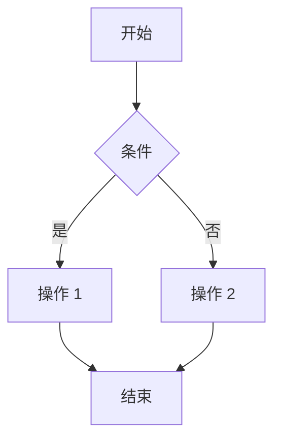

<div align="center">
  
</div>

# Dory

> 🐟 一个轻量级的技术文档静态站点生成器。

Dory 是一个为开发者构建的轻量级静态站点生成器，提供快速、干净、可自定义的文档 —— 无需服务器端渲染、复杂的 CI/CD 设置或特定云平台的约束。

使用 [Preact](https://preactjs.com/)、[Vite](https://vitejs.dev/)、[Tailwind CSS](https://tailwindcss.com/)、[Mermaid](https://mermaid.js.org/) 和 [TypeScript](https://www.typescriptlang.org/) 构建。

## 🚀 为什么选择 Dory？

我们在构建文档平台时创建了 Dory，因为对臃肿的框架、缓慢的构建时间和晦涩的部署错误感到沮丧。

Dory 的特点：

- 🧠 **简单** —— 放入 `.mdx` 文件并配置一个 `dory.json`。
- ⚡ **快速** —— 开发时即时热重载，生产环境快速静态构建。
- 🌐 **可移植** —— 无 SSR，无锁定，可部署到任何地方。
- 🧩 **灵活** —— 可定制的主题，可读的代码库，最小化的魔法。

## 🎬 快速演示

https://github.com/user-attachments/assets/5a2840ce-a0b9-41fd-8d15-3ee1d2356f07

## ✨ 功能特性

- 📄 使用 `.mdx`（Markdown + JSX）编写文档
- 🧭 使用单个 `dory.json` 配置站点结构
- 🧪 内置组件用于布局、导航和代码高亮
- 🔁 开发时即时热重载
- 📊 支持 Mermaid 图表和流程图
- 🎨 通过 Tailwind 和最小化的主题覆盖进行自定义
- 🌍 部署到 Netlify、Vercel、S3、GitHub Pages —— 随你选择
- 🌐 HTTP 客户端用于测试 API 端点（从 openapi.json 自动推断）

## 📦 CLI 安装

全局安装 Dory 以使用 CLI 工具：

```bash
npm install -g @clidey/dory
```

### CLI 用法

安装后，你可以使用 `dory` 命令：

#### `dory build`

构建你的文档站点：
- 检查当前目录中的 `dory.json`
- 清除并准备 `docs` 文件夹
- 将配置复制到 `docs` 文件夹
- 运行构建过程
- 创建 `dist` 文件夹

#### `dory dev`

启动开发服务器：
- 启动本地开发服务器
- 即时热重载
- 实时预览更改

#### `dory serve`

在本地预览构建的站点：
- 从 `dist` 文件夹提供服务
- 测试生产构建

## 配置

在项目根目录创建 `dory.json` 文件：

```json
{
  "name": "我的文档",
  "description": "项目文档",
  "nav": [
    { "title": "首页", "href": "/" },
    { "title": "指南", "href": "/guide" },
    { "title": "API", "href": "/api" }
  ],
  "sidebar": [
    {
      "title": "入门",
      "items": [
        { "title": "介绍", "href": "/guide/introduction" },
        { "title": "安装", "href": "/guide/installation" }
      ]
    }
  ]
}
```

## 目录结构

```
my-docs/
├── docs/
│   ├── index.mdx
│   ├── guide/
│   │   ├── introduction.mdx
│   │   └── installation.mdx
│   └── api/
│       └── reference.mdx
├── dory.json
└── package.json
```

## MDX 支持

Dory 支持 MDX（Markdown + JSX），你可以：

- 使用标准 Markdown 语法
- 在 Markdown 中嵌入 JSX 组件
- 使用内置组件
- 创建自定义组件

### 内置组件

```mdx
import { Callout, CodeBlock, Tabs } from '@clidey/dory'

<Callout type="info">
  这是一个信息提示框。
</Callout>

<CodeBlock language="javascript">
console.log('Hello, Dory!')
</CodeBlock>

<Tabs items={['Tab 1', 'Tab 2']}>
  <Tab>内容 1</Tab>
  <Tab>内容 2</Tab>
</Tabs>
```

## Mermaid 支持

Dory 内置支持 Mermaid 图表：

````mdx

````

## 部署

### Netlify

1. 将项目推送到 GitHub
2. 在 Netlify 中连接仓库
3. 设置构建命令：`dory build`
4. 设置发布目录：`dist`

### Vercel

1. 将项目推送到 GitHub
2. 在 Vercel 中导入项目
3. 设置构建命令：`dory build`
4. 设置输出目录：`dist`

### GitHub Pages

1. 在仓库设置中启用 GitHub Pages
2. 设置 GitHub Actions 工作流

## 许可证

MIT

---

> 项目地址：[clidey/dory](https://github.com/clidey/dory)
> npm 包：[@clidey/dory](https://www.npmjs.com/package/@clidey/dory)
