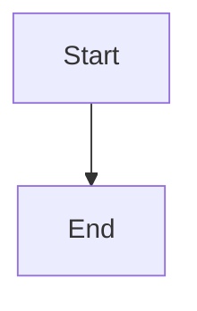
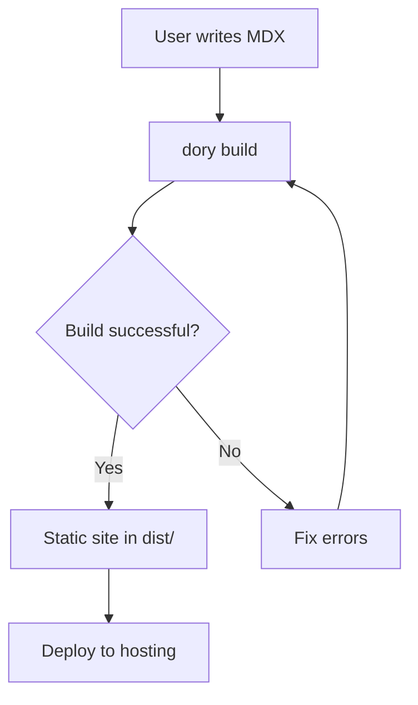
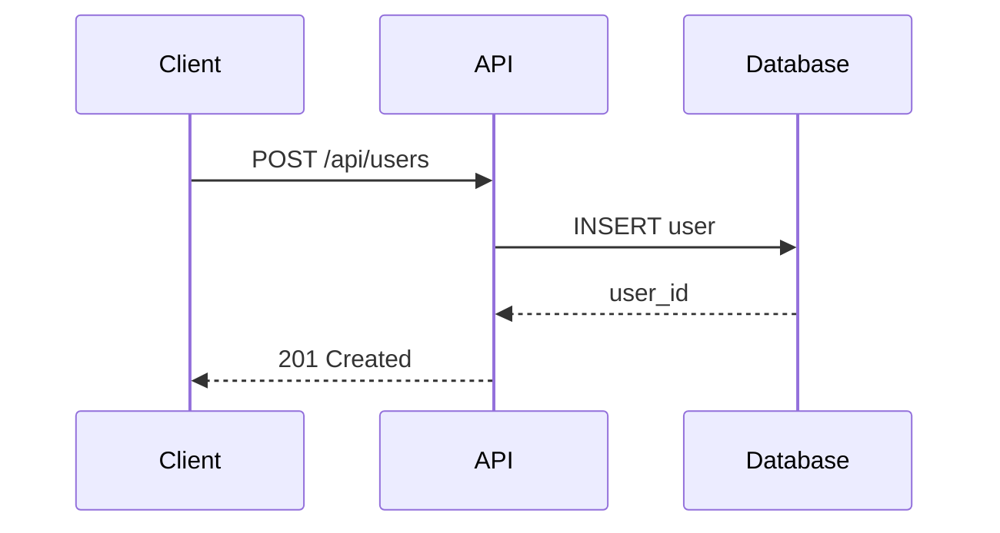
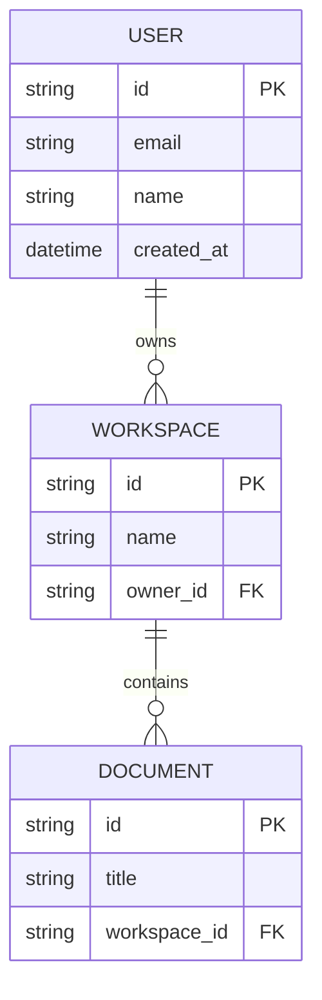
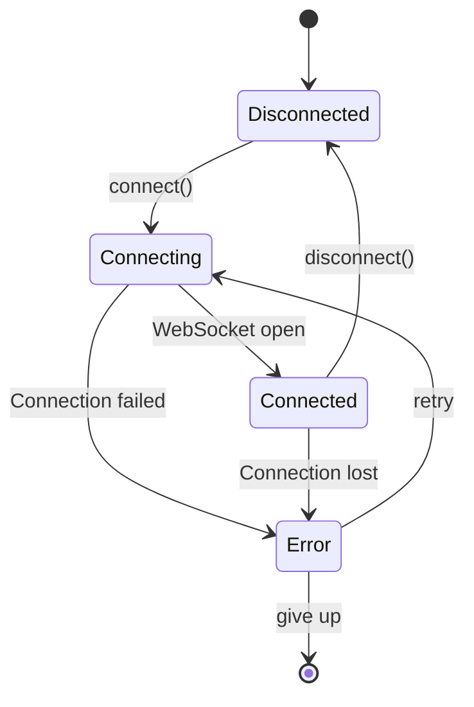
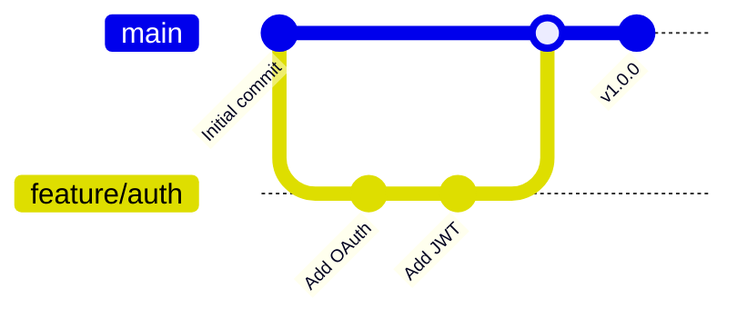
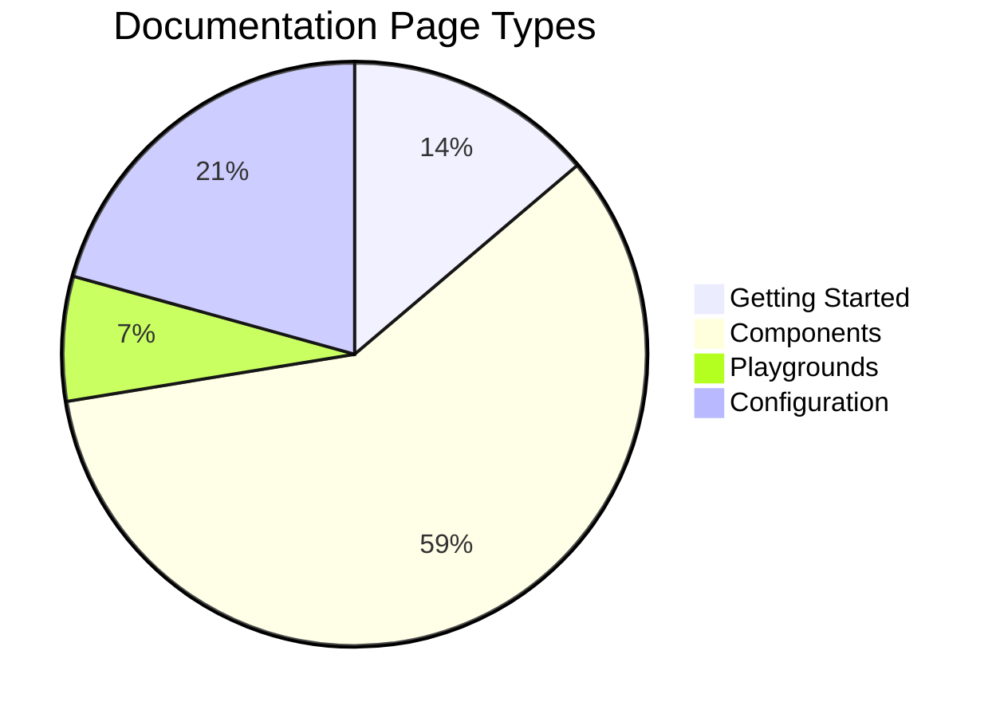

# Mermaid Diagrams

Use fenced code blocks with the `mermaid` language identifier to render diagrams. Dory automatically detects mermaid syntax and renders it using the [Mermaid](https://mermaid.js.org) library.

**Syntax:**

```

```

## Flowchart



## Sequence Diagram



## Entity Relationship Diagram



## State Diagram



## Git Graph



## Pie Chart



## Supported Diagram Types

| Type | Identifier | Description |
| --- | --- | --- |
| Flowchart | `flowchart` | Process flows and decision trees |
| Sequence | `sequenceDiagram` | Interaction between participants |
| Class | `classDiagram` | Object-oriented class structures |
| State | `stateDiagram-v2` | State machine transitions |
| ER Diagram | `erDiagram` | Database entity relationships |
| Git Graph | `gitGraph` | Git branch history |
| Gantt | `gantt` | Project timelines |
| Pie Chart | `pie` | Proportional data |

## Fullscreen Mode

Click any rendered diagram to view it fullscreen. This is useful for complex diagrams that are hard to read at the default size.

<Note>
  Mermaid diagrams are lazy-loaded. The first render on a page may take a moment while the Mermaid library initializes.
</Note>
