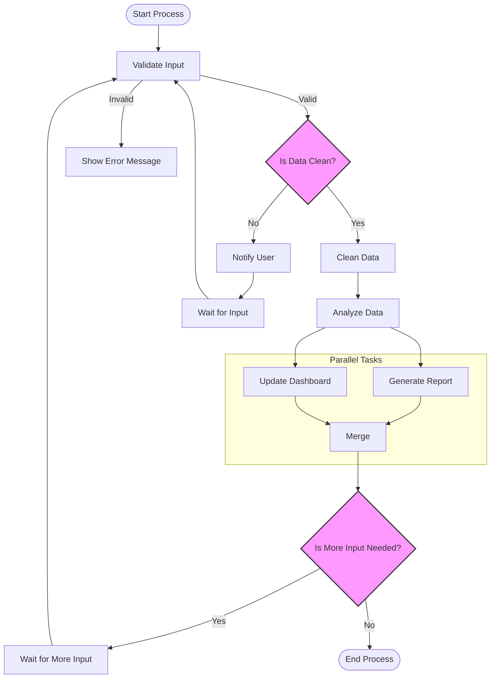

## Headings Examples

```mdx
# Heading 1
```
# Heading 1

```mdx
## Heading 2
```
# Heading 2

```mdx
### Heading 3
```
# Heading 3
```mdx
#### Heading 4
```
# Heading 4
```mdx
##### Heading 5
```
# Heading 5
```mdx
###### Heading 6
```
# Heading 6

<br />

## Lists Examples

```mdx
- List item 1
- List item 2
- List item 3
```

- List item 1
- List item 2
- List item 3

```mdx
1. List item 1
2. List item 2
3. List item 3
```

1. List item 1
2. List item 2
3. List item 3


<br />

### Images

```mdx

```


<br />
<br />
<br />

## Code Components

### Code Block
```typescript
function example() {
  return "Hello World";
}
```

### Code Group Block

<CodeGroup>
```typescript
function example(): string {
  return "Hello World";
}
```
```javascript
function example() {
  return "Hello World";
}
```
</CodeGroup>


<br />
<br />
<br />


## Interactive Components

### Mermaid

```mdx
mermaid
graph TD

  %% Main Start
  Start([Start Process]) --> Validate[Validate Input]

  %% Decision Point
  Validate -->|Valid| ProcessData{Is Data Clean?}
  Validate -->|Invalid| Error[Show Error Message]

  %% Clean Data Branch
  ProcessData -->|Yes| Clean[Clean Data]
  Clean --> Analyze[Analyze Data]

  %% Dirty Data Branch
  ProcessData -->|No| Notify[Notify User]
  Notify --> Wait[Wait for Input]
  Wait --> Validate

  %% Parallel Branches After Analysis
  Analyze --> Split1 & Split2

  subgraph Parallel Tasks
    Split1[Generate Report] --> Merge
    Split2[Update Dashboard] --> Merge
  end

  Merge --> Decision2{Is More Input Needed?}
  Decision2 -->|Yes| WaitMore[Wait for More Input]
  WaitMore --> Validate
  Decision2 -->|No| End([End Process])

  %% Style and Class Definitions
  classDef decision fill:#f9f,stroke:#333,stroke-width:2px;
  class ProcessData,Decision2 decision;

```

<strong>
<p>Note: Mermaid should be inside a code block with type "mermaid"</p>
</strong>



### Accordion

```mdx
<AccordionGroup>
  <Accordion title="First Section" icon="DocumentIcon">
    This is the content of the first accordion section.
  </Accordion>
  <Accordion title="Second Section" icon="CodeBracketIcon">
    This is the content of the second accordion section.
  </Accordion>
</AccordionGroup>
```

<AccordionGroup>
  <Accordion title="First Section" icon="DocumentIcon">
    This is the content of the first accordion section.
  </Accordion>
  <Accordion title="Second Section" icon="CodeBracketIcon">
    This is the content of the second accordion section.
  </Accordion>
</AccordionGroup>

### Callouts

```mdx
<Note>
  This is a note callout with important information.
</Note>
```

<Note>
  This is a note callout with important information.
</Note>

```mdx
<Warning>
  This is a warning callout for critical information.
</Warning>
```

<Warning>
  This is a warning callout for critical information.
</Warning>

```mdx
<Info>
  This is an info callout for general information.
</Info>
```

<Info>
  This is an info callout for general information.
</Info>

```mdx
<Tip>
  This is a tip callout for helpful suggestions.
</Tip>
```

<Tip>
  This is a tip callout for helpful suggestions.
</Tip>

```mdx
<Check>
  This is a check callout for completed items.
</Check>
```

<Check>
  This is a check callout for completed items.
</Check>


<br />

### Cards
```mdx
<CardGroup cols={2}>
  <Card 
    title="Example Card" 
    description="This is an example card component with an icon and title."
    icon="FileText"
    href="#"
  />
  <Card 
    title="Another Card" 
    description="This is another example card with different content."
    icon="Code"
    href="#"
  />
</CardGroup>
```

<CardGroup cols={2}>
  <Card 
    title="Example Card" 
    description="This is an example card component with an icon and title."
    icon="FileText"
    href="#"
  />
  <Card 
    title="Another Card" 
    description="This is another example card with different content."
    icon="Code"
    href="#"
  />
</CardGroup>

<br />

### Expandable

```mdx
<Expandable title="Click to Expand">
  This is an expandable section that can be toggled.
</Expandable>
```

<Expandable title="Click to Expand">
  This is an expandable section that can be toggled.
</Expandable>

### Source

```mdx
<Source url="https://github.com/clidey/dory" paths={[
  { path: "src/mdx/source.tsx", range: "1-46" },
  { path: "docs/features.mdx", range: "318-322" },
]} />
```

<Source url="https://github.com/clidey/dory" paths={[
  { path: "src/mdx/source.tsx", range: "1-46" },
  { path: "docs/features.mdx", range: "318-322" },
]} />

<br />
<br />
<br />


## Special Components

### Grids

#### Rows
```mdx
<Row cols={2}>
  <Icon icon="FileText" />
  <Icon icon="CheckCircle" />
</Row>
```

<Row cols={2}>
  <Icon icon="FileText" />
  <Icon icon="CheckCircle" />
</Row>

<br />

#### Columns

```mdx
<Col>
  <Icon icon="FileText" />
  <Icon icon="FileText" />
</Col>
```

<Col>
  <Icon icon="FileText" />
  <Icon icon="FileText" />
</Col>

<br />
<br />
<br />

### Latex

```mdx
<Latex>
E = mc^2
</Latex>
```

<Latex>
E = mc^2
</Latex>

<br />
<br />
<br />

### Tables

```mdx
| Property | Description                           |
| -------- | ------------------------------------- |
| Name     | Full name of user                     |
| Age      | Reported age                          |
| Joined   | Whether the user joined the community |
```

| Property | Description                           |
| -------- | ------------------------------------- |
| Name     | Full name of user                     |
| Age      | Reported age                          |
| Joined   | Whether the user joined the community |


### Steps

```mdx
<Steps>
  <Step title="First Step">
  This is the first step in the process.
  </Step>
  <Step title="Second Step">
  This is the second step in the process.
  </Step>
</Steps>
```

<Steps>
  <Step title="First Step">
  This is the first step in the process.
  </Step>
  <Step title="Second Step">
  This is the second step in the process.
  </Step>
</Steps>

### Icons

```mdx
<Col rows={2}>
  <Icon icon="Code" />
  <Icon icon="FileText" />
  <Icon icon="CheckCircle" />
</Col>
```

<Row cols={3}>
<Icon icon="Code" />
<Icon icon="FileText" />
<Icon icon="CheckCircle" />
</Row>
